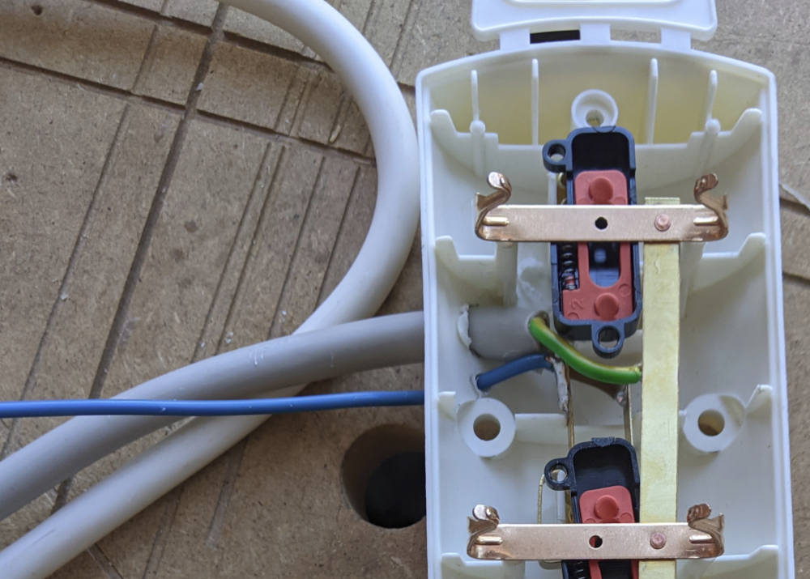

# Shroompi

Code and instructions to build a raspberry-pi based control system for growing mushrooms.


Disclaimer. This can be any kind of mushrooms. If you choose to use this to grow varieties that have been illegalized by the authorities whose jurisdiction you are unlucky enough to fall under, you obviously do so at your own responsibility.


### Mycology

Fungi grow in roughly two phases that concern us: the incubation phase and the fruiting phase.

* During the incubation phase, a substrate (food) with some added spores is placed in a dark and warm environment. At the end of this phase, the fungus has completely "colonized" the substrate, which is then completely wrapped in fibre-/moss-like mycelium. The incubator is a styrofoam box with an electric heater.

* During the fruiting phase, the mycelium-wrapped substrate is placed in a humid environment. This causes the actual mushrooms (the "fruiting bodies") to grow for us to harvest and eat. The fruiting chamber is a closed (semi-)transparent plastic tub with wet towels, with 2 attached fans to force air exchange.

### Pi tasks

Though mushrooms can be grown easily without any automation, there are a few things we can use the raspberry pi for:

* Temperature control during incubation phase: measure temperature and turn heater on/off.
* CO2 control during fruiting phase: measure CO2 level and turn fans on/off.
* Timelapse-photography: taking pictures at fixed intervals. Using a raspberry pi ribbon camera or a USB-connected digital camera. Combined with controlling lights (LED strips) to ensure even light conditions/exposure.
* Monitoring: making measurements (temperature [degC], relative humidity [%], CO2-level [ppm]) and/or photos available for a human to look at. Measurements can be shown on a connected LCD display. 

Below I describe how to build a system that includes all; if you want to build it for yourself, you can leave out the parts related to functions that are not of interest to you.

### System overview

The system is designed to simultaneously control one incubator (with the components on the bottom) and one fruiting chamber (with the components on the left):


Going in clockwise direction starting at the top:

* I want to be able to also use my older Raspberry Pi, without on-board W-LAN and a with a 26-pin header. In that case, I use the LAN port / wired internet for the initial setup, and a USB W-LAN adapter after that. Modern Pis have WLAN on board and more pins - anything described here can also be done with those more recent versions.
* LED strips come in many varieties. The easiest for our purposes here is one that does not require data - simply providing the specified voltage lights them up. I had a strip lying around that takes 24 V DC, but other common voltages are 12 V DC and 5 V DC. 
* The Raspberry Pi Camera Module is connected with a ribbon cable to a dedicated port on the Pi.
* DSLR cameras can be controlled by connecting them via one of the USB ports. For long-time operation, I run it off of mains power (using a DC coupler in the battery compartment).
* The electric heater is a cheap one running off the mains and is quite some overkill for the small incubator - but it works. Switching is done with a solid-state relay. For safety reasons I'm using a heater with a built-in thermostat, so that it won't overheat, even in the unlikely event that control by the Pi has an always-on malfunction. 
* The DHT22 is a small sensor for temperature and relative humidity.
* The MH-Z19C is a CO2 sensor. There are cheaper sensors measuring 'equivalent CO2' levels based off of other gases. As I can imagine that mushroom breath is different from human breath, I decided to not use those.
* I'm using some old computer fans which seem to all run on 12 V DC. 

Not drawn but also included:

* An LCD display (20x4) is connected to show measurement values and log messages.

Here's some pictures of the assembled system:

<div style="width:100; height:200px; background-color:yellow"></div>

# Schematics

### Power and control

There are quite a few voltage levels needed; in my case 24 V DC for the LED strip, 12 V DC for the fans, and 5 V DC for the Pi itself. They are supplied with various power bricks (AC/DC converters) off the mains, and share a common negative voltage (ground). As I might use 12 V DC LED strips in the future, I've added the possibility for a jumper to bridge the two and use only one source to power both.

The camera uses a separate power brick, and the heater uses mains (230 V AC where I live).


* To switch power to the LED strip, an N-channel MOSFET is used. A 100 kΩ pull-down resistor is added between Gate and Source. No high switching frequencies are required so many MOSFETs will do. The only thing to look out for: the Gate-to-Source threshold Voltage should be well below 3.3 V (e.g. 2 V), so that it is properly 'on' (i.e., with low resistance) when 3.3 V is supplied at the Gate through the GPIO pin. Also the maximum Drain-to-Source voltage should be above what we are supplying - 24 V in this case. A momentary switch is added so that the MOSFET can be manually bypassed, in order to test that the LEDs are working.
* For the fans and for the relay, the exact same concept is used.

### Sensors

The DHT22 and MH-Z19C require power (5V). The DHT22 requires one arbitrary GPIO pin, and the MH-Z19C requires the RXD (15) and TXD (14) pins. I needed to solder a 10kOhm pullup resistor to the DHT22 (between +V and Data, likely due to the long cable).

### Display

[Here](https://www.raspberrypi-spy.co.uk/2012/08/16x2-lcd-module-control-with-backlight-switch/) is a great page explaining the wiring I used for the display. 

### Button

I also added a button that is used to toggle the display's backlighting. It's read by the Pi and doesn't directly connect to the display.

### Summary: Pins

The following number and types of gpio pins are required for each of the components:


| Component | General | GPIO pin(s) in my project|
| --- | --- | --- |
| LED strip | 1 pin to control the MOSFET | 17 |
| Fans | 1 pin to control the MOSFET | 18 |
| Solid-state relay | 1 pin to control the MOSFET | 27 |
| DHT22 sensor | 1 pin for communication | 4 |
| MH-Z19C sensor | 2 pins (TXD and RXD) for communication | 14 and 15 (not freely choosable)
| Display output | 6 pins for communication, 1 to turn backlight on | 12 (rs), 11 (en), 7...10 (d4...d7), 8 (backlight) |
| Display on/off input | 1 pin to listen to user button push| 7 |

Total: 14

### Layout

Using a prototyping hat for the Pi, I sketched and later soldered the layout (the screen connector was moved 2 positions to the left).


empty hat             |  with components
:-------------------------:|:-------------------------:
  |  


### Other Hardware

A wooden base plate is used, and the Pi is screwed onto it, as well as a power strip. The power strip holds the various power bricks. One separate outlet is also used; this one is for the electric heater and controlled by the solid-state relay - the wiring is shown below.

a | b  | c | d
:--:|:--:|:--:|:--:
 |  |  | 


The Raspberry Pi Camera Module is attached to a 1-meter-long ribbon cable, and the DSLR camera is attached to both the USB port and its dedicated power brick.

# Software

A python package was written to control the Pi; it automatically starts on booting up.

To stay concise, not all steps are explained in enough detail for newcomers to the Raspberry Pi; some googling might be necessary.

### Preparing the Pi

* Flash a fresh install of the latest Raspberry Pi operating system onto an SD card. 
  * I personally don't use the GUI, so I install Raspberry Pi OS Lite.
  * Depending on your timelapse ambitions, make sure the SD card has enough storage. This mainly depends on the resolution of the images, the time interval between them, and how often you want to (manually or automatedly, see below) move them from the card to e.g. your desktop PC for further processing.
* Before putting the SD card into the Pi, enable SSH and (optionally but recommended) prepare key-based access.
  * SSH is enabled by placing an empty file `ssh` into the boot folder of the SD card;
  * For key-based access, you need to create a private-public key pair on the machine you want access the Pi from (e.g. your desktop PC), and put the public key into a specific folder/file path on the Pi. There are many tutorials online.
* Put the SD card into the Pi and power it up (having only the camera module connected for now). Also, use a LAN cable if you're having trouble in the next steps.
* Find out the Pi's IP address from your router's admin page. Optionally but recommended: give it a fixed IP address so it's always found at the same one.
* You should be able to "SSH into" the Pi with `ssh pi@192.168.1.100` (replacing the IP address with your Pi's) from a terminal on your desktop PC. (If it's on windows you may need an additional program such as Putty.) It should be in the same network as the Pi. The default password is `raspberry`.
* Finish setting up the Pi:
  * Change the password with `passwd.`
  * Finish setting up the SSH keys. If successful, a password is no longer needed to SSH into the Pi (from the machine whose public key you have stored on the Pi).
  * Open the configuration with `sudo raspi-config`. Under '3. interface', enable at least '1. camera module' and '6. serial port', and have a look at other settings (time zone for example). 
  * Update all packages with `sudo apt-get update` and `sudo apt-get upgrade`.

### Configure and copy the program

The `shroompi` python package is contained in the `shroompi` folder of this repository. It is assumed this folder is present on your desktop PC.

* The script can be configured by opening and editing the `__main__.py` file. There is some central configuration at the top (pin numbers and available components), and additional configuration further below in the code (intervals for measurements, taking photos, etc., and target values for heating, fanning etc.). 

* The script can be uploaded to the Pi using the secure copy command `scp -r shroompi pi@192.168.1.100:`
* Power off the pi, connect the prototyping hat and all peripherals, and power it up again.

### Testing the program

Likely, many packages are missing and need to be installed. They are most easily found by running the program and observing the error messages. A non-exhaustive list is found in `requirements_apt` and `requirements_pip`.

* SSH into it.
* Run module. Serial communication via RX/TX with the MH-Z19 seems to be forbidden for normal users, so it might be necessary to run as `sudo` like so: 
  ```bash
  pi@raspberrypi:~ $ sudo python3 -m scroompi
  ```
  Information should be logged to the computer screen. 

  * If packages are missing:
  ```
  Traceback (most recent call last):
  File "/usr/lib/python3.7/runpy.py", line 193, in _run_module_as_main
    "__main__", mod_spec)
  File "/usr/lib/python3.7/runpy.py", line 85, in _run_code
    exec(code, run_globals)
  File "/home/pi/shroompi/__main__.py", line 6, in <module>
    from .display import Display, DisplayHandler, DisplayThread
  File "/home/pi/shroompi/display.py", line 5, in <module>
    from adafruit_character_lcd.character_lcd import Character_LCD_Mono
  ModuleNotFoundError: No module named 'adafruit_character_lcd'
  ```
  * If all is well:
  ```
  Starting init, preparing threads
  Setting up status LED.
  Testing: blink status LED 5 times.
  Config: display connected.
  This message should appear on display.
  Initialising display thread.
  Config: timelapse ON.
  Config: timelapse with lights. Setting up LED strip.
  Testing: blink LED strip 4 times
  Connecting to ribbon camera.
  mmal: mmal_vc_component_create: failed to create component 'vc.ril.camera' (1:ENOMEM)
  mmal: mmal_component_create_core: could not create component 'vc.ril.camera' (1)
  Can't connect ribbon cam. Ignore warning if none connected.
  Connecting to USB camera.
  Manufacturer: Nikon Corporation
  ...
  ```

### Camera settings

A few tips/remarks if you're using a USB-connected camera:

* Many settings can be put in the script's configuration (in `__main__.py`), but it's easier to set values that should not change (whitebalance, image size, etc) on the camera.
* For settings that *do* need to be set through the script (e.g., if you want to take 2 photos using distinct apertures) - make sure the camera is able to accept them (in this example, it should be in A or M mode).
* I've had some problems shooting in Raw+Jpg and decided to shoot only in jpg. I've also had problems with my D5100 (it would only take a single photo before throwing an error), but as my D5600 didn't cause problems I did not investigate further. Your mileage may vary.
* The shooting is handled by `gphoto2` ([link](https://github.com/jim-easterbrook/python-gphoto2)). The settings that can be changed, and the values that are accepted, depend on the camera model, current shooting mode, and attached lens. I added a debug attributes `.debug_listcompleteconfig` and `.debug_findsetting` to the `Cam` class in the `usbcam.py` script - inspect / run this file to check them out. Samle usage:
  ```
  c = Cam()
  c.debug_listcompleteconfig()
  ...
  . Setting: imagesize
           6000x4000 (6000x4000, 4496x3000, 2992x2000)
  . Setting: iso
           1600 (100, 125, 160, 200, 250, 320, 400, 500, 640, 800, 1000, 1250, 1600, 2000, 2500, 3200, 4000, 5000, 6400, 8000, 10000, 12800, 16000, 20000, 25600)
  . Setting: isoauto
           On (On, Off)
  . Setting: whitebalance
           Automatic (Automatic, Daylight, Fluorescent, Tungsten, Flash, Cloudy, Shade, Preset)
  . Setting: colorspace
           sRGB (sRGB, AdobeRGB)
  . Setting: autoiso
           Off (On, Off)
  ...
  ```

### Autostart

If the previous step works, the only thing left is to make sure the program starts automatically upon system boot:

* Create a file `/lib/systemd/system/shroompi.service` on the Pi with following contents:
  ```bash
  [Unit]
  Description=Shroompi
  After=network.target

  [Service]
  ExecStart=/usr/bin/python3 -m shroompi
  WorkingDirectory=/home/pi/
  StandardOutput=inherit
  StandardError=inherit
  Restart=always
  User=root

  [Install]
  WantedBy=multi-user.target
  ```

* `sudo chmod +644 /lib/systemd/system/shroompi.service` to change its permissions.

* `sudo systemctl daemon-reload` to discover the new service.
* `sudo systemctl start shroompi.service`    to test if can be started. No output is shown on the screen, but the lights, fans, display etc should show the same behavior. (There might be some problems accessing the camera over USB - ignore these; they are resolved upon system boot).
* `sudo systemctl stop shroompi.service`    to stop the service.
* `sudo systemctl enable shroompi.service`    to start on boot.

Reboot the Pi to see if it indeed starts with the program as wanted. 

### Getting output

Output can be copied over from the Pi with the following commands, initiated from the desktop PC (make sure the folder `~/output` exists):

```bash
rsync -av --remove-source-files -e "ssh" pi@192.168.1.100:output/images/ ~/output/images/
rsync -av -e "ssh" pi@192.168.1.100:output/ ~/output/
```

The first line moves the images files over to the desktop PC, freeing up space on the Pi's SD card.
The second line copies the other (smaller) files over as well, but leaves a copy on the Pi.

Placed in a `bash` script (like `get_output.sh`), these commands can be executed easily by clicking on the file. Or for even more convenience, setting it up as a cron job to automatically run every e.g. hour.


Anyways, that was all - Happy cultivating!

